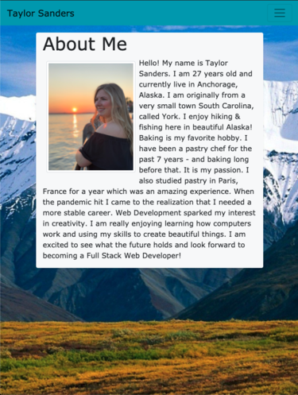
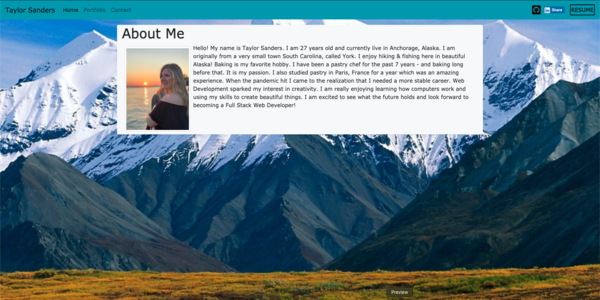
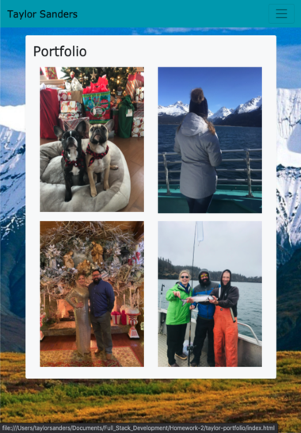
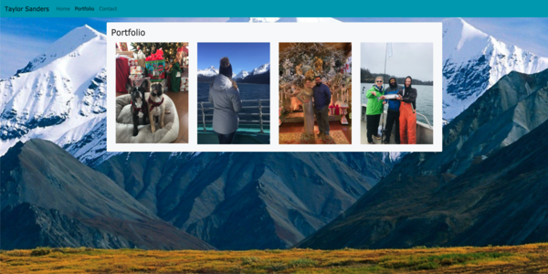
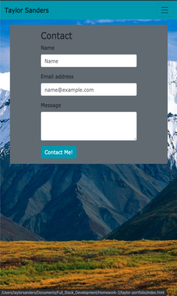
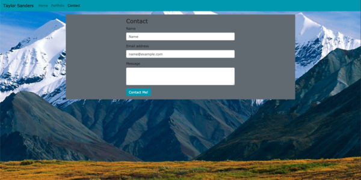

# taylor-portfolio

## description
Hello! This project's purpose was to build and customize my first Responsive Portfolio. This is to ensure that no matter how big or small your screen is - it will still have a responsive design and work correctly.

I have also accomplished:

* A working Nav Bar on all pages. (Home, Portfolio and Contact pages)
* Working links to my personal LinkedIn, GitHub and Resume Doc.
* Utilized Bootstrap to minimize the use of Media Queries.
* Created a space for my personal Bio and images.
* Used Semantic HTML.

[Link to deployed application](https://justpeachy8688.github.io/taylor-portfolio)

